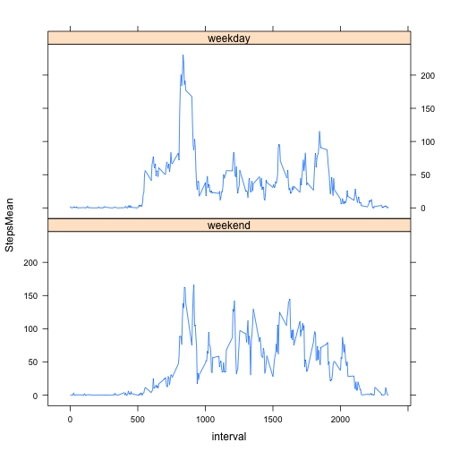

**Reading in the data**


```r
activityds<-read.csv("./data/activity.csv", sep=",", header=TRUE)
```

Loading needed libraries


```r
library(dplyr)
library(lubridate)
library(lattice)
```

Calculating total number of steps taken per day


```r
stepsperday <-
  activityds %>%
  group_by(date) %>%
  summarize(sum(steps))
```
**Histogram of the total number of steps**


```r
names(stepsperday)[2]<-"StepsSum"  ##rename sums column
hist(stepsperday$StepsSum, 
     xlab= "Number of Steps",
     ylab="Frequency",
     main="Frequency of Total Number of Steps Taken Each Day")
```

 

**Calculate mean and median number of steps taken each day**

```r
stepsmean<-mean(stepsperday$StepsSum, na.rm=TRUE)
stepsmedian<-median(stepsperday$StepsSum, na.rm=TRUE)
```
**The mean number of steps taken each day is 1.0766189 &times; 10<sup>4</sup>**  
**The median number of steps taken each day is 10765**


**Time series plot of the average number of steps taken (averaged across all days) versus the 5-minute intervals**

```r
stepsperinterval <-
  activityds %>%
  group_by(interval) %>%
  summarize(mean(steps, na.rm=TRUE)) ##calculate mean

names(stepsperinterval)[2]<-"StepsMean"  ##rename mean column

plot(stepsperinterval$interval, stepsperinterval$StepsMean, 
     type="l", 
     lwd=3,
     xlab= "5-Minute Interval",
     ylab="Average Number of Steps Taken",
     main="Steps Taken per Interval")
```

 

**Calculate the 5-minute interval that, on average, contains the maximum number of steps**

```r
MaxIntervalSteps<-max(stepsperinterval$StepsMean)
maxintervaltable<-filter(stepsperinterval, StepsMean == MaxIntervalSteps)
MaxInterval<-maxintervaltable[,1]
```
**The 5-minute interval that, on average, contains the maximum number of steps is 835**

**My strategy for dealing with missing data was to replace NAs with the mean of the steps taken per interval**

```r
## Calculate and report the total number of missing values in the dataset
noNAs<-na.omit(activityds)
noNAsrows<-nrow(noNAs)
allrows<-nrow(activityds)
numbermissingvalues<-allrows - noNAsrows

##  mean of steps taken per interval
stepsperinterval <-
  activityds %>%
  group_by(interval) %>%
  summarize(mean(steps, na.rm=TRUE))
names(stepsperinterval)[2]<-"StepsMean"  ##rename mean column

## just rows with NAs
hasNAs<-subset(activityds, is.na(steps))

## swap in mean per interval where NAs exist
swappedNAs<-left_join(hasNAs, stepsperinterval, by="interval")
swappedNAscorrect<-swappedNAs%>%select(StepsMean, date, interval) ## change column order
names(swappedNAscorrect)[1]<-"steps"  ##rename mean column

## combine split tables
allnoNAs<-rbind(noNAs, swappedNAscorrect)
```

**Histogram of the total number of steps taken each day after missing values were imputed**


```r
##  total number of steps taken per day, using mean as NAs
stepsperday2 <-
  allnoNAs %>%
  group_by(date) %>%
  summarize(sum(steps))

## histogram of the total number of steps taken each day
names(stepsperday2)[2]<-"StepsSum"  ##rename sums column
hist(stepsperday2$StepsSum, 
     xlab= "Number of Steps",
     ylab="Frequency",
     main="Frequency of Total Number of Steps Taken Per Day, Mean for NAs")
```

 

I created a new factor variable in the dataset with two levels – “weekday” and “weekend” indicating whether a given date is a weekday or weekend day

```r
allnoNAs$date<-ymd(allnoNAs$date) ## change to date format
weekdaylist <- c('Monday', 'Tuesday', 'Wednesday', 'Thursday', 'Friday') ## list of weekdays
## makes factor of weekend or weekday, adds column
allnoNAs$weekend <- factor((weekdays(allnoNAs$date) %in% weekdaylist),
                        levels=c(FALSE, TRUE), labels=c("weekend", "weekday"))
```

**Panel plot comparing the average number of steps taken per 5-minute interval across weekdays and weekends**

```r
weekendmeansteps <-
  allnoNAs %>%
  group_by(interval, weekend) %>%
  summarize(mean(steps, na.rm=TRUE))
names(weekendmeansteps)[3]<-"StepsMean"  ##rename mean column
xyplot(StepsMean ~ interval | weekend, weekendmeansteps, layout=c(1,2), type="l")
```

 
